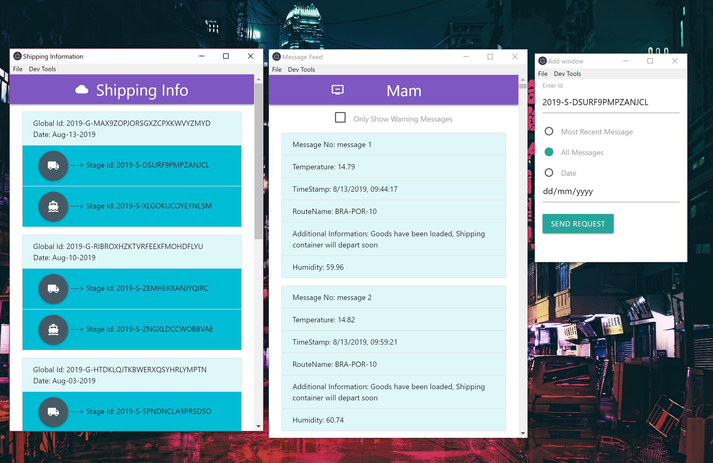

# mam_logistics_application
mam logistics application

Proof of concept logistics application that shows how IOTA's MAM(Masked Authenticated Message) could be used to manage data produced by IoT devices in the logistics industry

This application was built using the Electron framework, Materilze CSS and several node.js packages including the MAM client libary ( https://github.com/iotaledger/mam.client.js )

text: .
